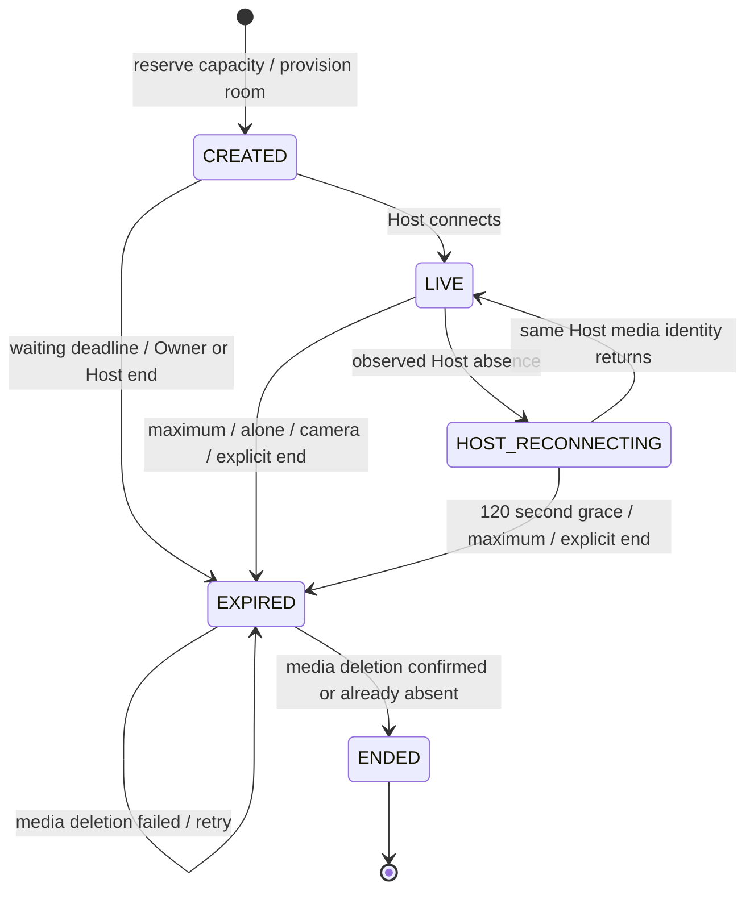

# Production hardening implementation and review

## Limit diagnosis: what the repository proves

No production logs, active process state, or LiveKit billing dashboard were available in this task. Therefore the exact production incident cannot be attributed to one limit with certainty. The repository had two distinct application-level rejection paths, neither based on LiveKit billing/minutes:

| Original path | Exact trigger and state | Staleness / reset behavior |
| --- | --- | --- |
| `InMemorySessionStore.create`, `DEMO_SESSION_LIMIT` | Non-ENDED session records reach `DEMO_MAX_ACTIVE_SESSIONS` (default 2), shared by all remote Hosts using the process | CREATED rooms abandoned before media starts and rooms abandoned after disconnect remain counted until maximum-duration cleanup. EXPIRED rooms remain counted until media deletion succeeds. A process restart clears the map. |
| `MemoryAccessStore.reserveCreation`, `DEMO_CREATION_LIMIT` | Owner-login/approved-visitor record has `creations >= DEMO_MAX_SESSION_CREATIONS_PER_ACCESS` (default 5) | Successful creation counts cumulatively; ending a room does not refund usage. Abandoned setup consumes a creation. Repeated creations could exhaust authorization even with no active sessions. Restart clears authorizations and counts. |
| Express rate-limit middleware | Per-IP route windows, access-request global window, Owner failed-login window and global login window | Separate from session capacity and creation usage; memory counters reset on restart. |
| Guest capacity | Ten non-removed Guest reservations | Previously disconnected Guests without explicit Leave could remain counted; real media presence now reconciles connections. |
| Push device limit | Ten stored push subscriptions | Unrelated to room capacity; Owner can remove subscriptions. |

Failed application-session creation already rolled back the reserved creation count. However, previously creation did not provision a LiveKit room at all: it returned success for the memory record and media creation happened later, so a subsequent camera/media setup failure still consumed usage. Host End also swallowed all LiveKit deletion errors, declaring a room ended even when media deletion failed. There was no first-Guest shutdown, Host-alone shutdown, Host disconnect deadline, or ownership constraint. These are concrete lifecycle/accounting defects, not evidence that LiveKit billing is exhausted.

The pass fixes these defects without increasing the two-room capacity or five-creation default. Creation now reserves an application slot, provisions media, and returns success only after provisioning succeeds. Failed setup releases its creation reservation and enters the shared cleanup path. An Owner usage reset is generation-aware, so a concurrent failed old reservation cannot subtract from new usage. The error messages distinguish capacity, authorization usage, existing session, and request throttling. Legacy `DEMO_*` error identifiers remain for API compatibility; they are not displayed as product wording.

## Server state machine

Camera recovery, first-Guest waiting, pending admission and Host-alone deadlines are orthogonal timestamp fields, not separate copies of room state. All timestamps live on the original server session. Refresh and recovery cannot move `createdAt`.

- Maximum: **180 minutes from successful application reservation**, including setup. Fixed server policy, not controlled by the legacy duration environment variable.
- Capacity: **2**, enforced synchronously by the store, including provisioning and cleanup-pending records. Legacy active-capacity environment values no longer override this product policy. No environment file/value was changed.
- Ownership: one active room per approved visitor authorization. Owner rooms use one stable Owner account key across Owner logins. Visitor authorizations remain browser-cookie capabilities; this does not identify the same person across separately approved authorizations.
- Sweep: every **5 seconds**, without overlapping sweeps, using LiveKit `listParticipants` and track publication state. Browser timers only render notices/countdowns.
- End: admission freezes before the first await; pending requests clear immediately. A shared in-flight deletion promise makes concurrent Host/Owner/sweep ends idempotent. Successful delete or already-absent room clears Guests and recovery timestamps, marks ENDED and releases capacity. Transport failure retains EXPIRED and retries, preventing an orphan from being treated as a free slot.
- Three-hour expiry has priority over all recovery states. LiveKit token expiration is bounded by the original room lifetime; deletion is what ends existing media.

## Joining and sharing

Public sessions enter Available Sessions after media provisioning succeeds. Discovery returns only a dedicated opaque discovery selector, a display label, and a basic state; it does not expose the internal session ID, room code, media token, or Host credentials. Locked/ended/provisioning sessions are omitted.

Public Guests enter their name, Request to Join, and wait. Hosts can Allow or Deny individually. Allow All Waiting sends an explicit snapshot of displayed request IDs; later requests remain pending. Requests expire after **120 seconds**, use a hashed browser-generated random secret, deduplicate by that secret, have a 20-record room bound and per-IP rate limits. Concurrent approval polling shares a single token issuance. Cancel Request explicitly removes the request; abrupt abandonment is bounded by expiration. Ending the room clears all requests. A Public room code/link still requires approval.

Private sessions never enter discovery. The four-character room code is the sole Guest credential; no PIN or Host approval is required. Copy Code copies only that code. Share Guest Link uses native sharing when available and clipboard fallback otherwise, with the current frontend origin and `/join?room=CODE`. Existing `/join/CODE` links still work. The join form validates/prepopulates the credential and preserves the display-name requirement. Invalid/expired invitations receive actionable messages. Link possession grants Guest access only, never Host or Owner authority.

The frontend sets `Referrer-Policy` through a no-referrer document meta tag. Application error logging does not record request bodies or secret queries. A reverse proxy/hosting provider may still log incoming query strings; logging policy there requires operational review. Four-character room codes deliberately trade entropy for usability and must be shared privately; rate limiting reduces guessing but is not high-entropy invitation security.

## Empty room timing

- No Guest has ever actually connected: Host warning at **5:00**, Keep Waiting / End Session actions; no answer ends at **5:30**.
- Keep Waiting is a one-way flag, not a timer reset: deadline becomes **8:00 from original creation**, with a final countdown at **7:30**.
- Actionable Public pending/allowed requests extend a near deadline to leave about 30 seconds for handling/admission. This can never extend empty waiting past **10:00 from creation**. Once resolved/expired, the previously granted remaining time runs out normally. Spam cannot sustain an unattended room indefinitely.
- Real Guest attendance permanently cancels the first-Guest rule. Token issuance alone is not attendance.
- After attendance, zero Guests starts **120 seconds**. Dismiss hides the notice only. A returning Guest cancels the deadline; the final 30 seconds remain visible even after dismissal.

## Host and camera recovery

An observed missing Host receives **120 seconds** to reconnect. Guests see a calm interrupted-connection notice. Recovery preserves the session, original clock, media identity and participants; grace clears only when LiveKit actually observes the Host, not when a recovery token is requested. If Guests arrive before any Host media connection, absence still starts a Host grace deadline.

The landing page checks active ownership on opening and foreground return, and the Create page queries active ownership first and shows Rejoin Session / End It & Start New. Rejoin restores a scoped Host cookie and returns the existing room. Replacement is serialized per authorization: old media deletion must complete before the new room can be reserved/provisioned. If deletion fails, no replacement is created. Owner termination wins over later recovery.

Initial camera failure keeps Start Session disabled and offers explicit retry with understandable permission/device-conflict guidance. No camera-free mode was added. During live use, missing/muted camera publication or a Host report of an ended/muted native track starts **120 seconds** of recovery. The explicit retry restarts/enables the actual published camera. Healthy server-observed publication plus a cleared local-loss report cancels recovery. Repeated losses receive new deadlines only after observed recovery. Intentional camera-off also has this bounded recovery window.

Host native zoom implementation and Guest 1x–3x local pinch/pan implementation were left intact. Camera retry uses the current facing mode; capability inspection continues to follow the actual track. Existing Safari/installed-PWA capture policies and Guest self-Leave credential checks remain intact.

## Owner operations and authentication

The centered responsive Owner page has a distinct Session Management section, Active Sessions `0/2` through `2/2`, room label/code, visibility, Host connection, Guests, pending requests, start time, remaining maximum time and lifecycle status. End Session, End All Sessions and Reset Host Creation Usage require browser confirmation. All use the existing Owner-cookie, custom-request-header, Origin and Sec-Fetch-Site protections. Cleanup is automatic; no unsafe clear-map button was added.

Login gains named/id-bearing semantic username/current-password inputs and an accessible show/hide control that preserves the entered password. Existing Remember Me semantics were correct and remain covered by tests: checked sends an HttpOnly persistent cookie for 30 days by default; unchecked omits persistence attributes and has a 12-hour server lifetime by default; Secure applies in production and SameSite=Lax is retained. Logout deletes the server credential and clears the cookie at the same path. Passwords are not stored in browser storage.

The authentication map remains memory-backed: restart invalidates even a persistent cookie. Browser session restore may also retain an unchecked session cookie until its server deadline. Native iCloud Keychain/Face ID selection is browser/OS behavior, not something web code can guarantee.

Visible portfolio/demonstration wording was replaced with Host approval and product-oriented copy, including Web Push fallback/body copy. ViewCircle and “Share your view. Stay connected.” remain unchanged.

## Edge-case decisions

| Case | Deterministic rule |
| --- | --- |
| Request at 4:59 | Pending request extends near-deadline handling time, bounded at 10 minutes. |
| Guest at waiting boundary | Presence is reconciled before waiting/alone expiration; the 3-hour deadline always wins. A connection after the final presence snapshot may lose to termination. |
| Guest leaves/returns | Observed return clears aloneSince; issuing a token alone does not. |
| Refresh, Wi-Fi/cellular, battery loss | Same Host identity; 120 seconds from server-observed absence. |
| Reconnect near 120-second boundary | Observed presence cancels grace before the decision; an already-frozen terminal session cannot recover. |
| Other browser with same authorization | Unique owner key prevents duplicate creation and returns structured existing-session data. |
| Replace with Guests present | Delete old room first; disconnect Guests; then provision replacement. |
| Owner End versus reconnect | EXPIRED/ENDED blocks new tokens and recovery. |
| Three hours during camera recovery | Maximum duration takes priority. |
| Repeated camera loss | Retain initial loss deadline until healthy camera is observed; subsequent actual recovery can start a new episode. |
| All Guests disappear | One timestamp per room starts a single alone deadline. |
| Host End and Owner End | Shared idempotent deletion task. |
| Pending request at expiry | Clear all request state and reject polling/admission. |
| Expired Private invitation | Reject join; show invitation-expired guidance. |
| Duplicate requests/polls | Secret deduplication and single in-flight token issuance. |
| Capacity 2/2 and stale expiry | Sweep retries cleanup; creation also reconciles due records before checking capacity. |
| Failed room creation | Roll back quota; retain cleanup-pending capacity if deletion cannot be confirmed. |
| Room already externally deleted | Not-found is successful cleanup. |
| Backend restart | Clear memory; block new creation while reconciling tagged orphan media rooms. |

## Remaining deployment limits

- Exactly one API process/replica is supported. Memory locks/capacity do not coordinate multiple replicas or overlapping deployments.
- New media rooms are tagged `application=viewcircle`. Startup and a 30-second orphan sweep delete tagged rooms missing from memory; creation is held during initial reconciliation. Existing untagged rooms from earlier versions cannot safely be distinguished from unrelated rooms in a shared LiveKit project and need operational review during rollout.
- While the backend is stopped/sleeping or LiveKit control-plane calls fail, it cannot guarantee a physical disconnect at a deadline. Cleanup retries; capacity remains held until deletion succeeds. Normal timing precision is the five-second sweep plus media API latency, not millisecond transaction isolation with the SFU.
- LiveKit publication state is not proof of visible video frames. Native-track loss reports improve detection while the Host page runs, but OS-suspended/frozen capture can be opaque to both browser and SFU. Physical-device testing remains necessary.
- Already-issued LiveKit bearer JWTs cannot be individually revoked by this in-memory API. They expire by the original maximum lifetime. Application admission rejects ended sessions; hostile direct SDK reuse of an otherwise valid token depends on LiveKit's room/deletion behavior. Stronger revocation requires a different media credential/persistence design.
- Persistent Owner authentication, access approvals, quotas and push subscriptions are lost on restart. No database/platform was introduced.
- Media APIs were mocked in automated tests; no production LiveKit session, billing, deployment or hardware camera behavior was exercised.

## Physical-device production acceptance plan

1. On iPhone Safari and installed PWA, create one Public and one Private session using two approved authorizations. Verify Owner shows 2/2 and a third authorization sees the capacity-specific message.
2. Share the Private code and native Guest link to a second device; enter a name, join without PIN/approval, end it, and verify the old invitation fails. Verify Private never appears in discovery.
3. Send several Public requests, deny one and Allow All Waiting; a later arrival must still wait. Cancel/abandon a request and verify expiration.
4. Leave a new room empty: observe 5:00 prompt and 5:30 shutdown; repeat with Keep Waiting and 7:30–8:00 countdown; repeat with requests arriving near 4:59.
5. Join then leave all Guests: dismiss the alone notice, observe final countdown; rejoin before zero and verify cancellation.
6. Refresh Host, change Wi-Fi/cellular, background/kill PWA, reopen within 120 seconds and Rejoin. Repeat beyond grace. Test End It & Start New while Guests remain and Owner End during recovery.
7. Deny camera initially, retry after enabling permission. Interrupt camera with another video app, return and retry; verify bounded recovery, no camera-free mode, and unchanged native Host zoom/camera switching.
8. Verify Guest pinch 1x–3x/pan, dock touch behavior, portrait/landscape, self-Leave, Safari handoff/background audio and Owner Web Push on real devices.
9. Test checked/unchecked Remember Me, close/reopen, Keychain autofill, show/hide and logout. Confirm expected re-login after backend restart.
10. Run an actual three-hour session in a controlled production acceptance window, checking 30/10/5-minute warnings and final minute. Observe media deletion and capacity release. Do not accelerate by changing environment values.

## Validation results

- Backend TypeScript: passed.
- Frontend TypeScript: passed.
- Backend and frontend ESLint, zero warnings: passed.
- Backend: 57 tests passed across 6 files.
- Frontend: 135 tests passed across 13 files.
- Chromium/WebKit: 70 tests passed (35 per browser), including mobile Owner login/dashboard, invitation query links, manifests, Host zoom, Guest pinch/pan and dock layouts. The final landing/manifest change passed a separate 10-test Chromium/WebKit recheck.
- Backend and frontend production builds: passed; PWA manifests/service-worker behavior covered by tests.
- `git diff --check`: passed.
- Owner mobile screenshot inspected at 390px width; no horizontal overflow and minimum 44px action targets verified in both browser engines.

Test execution initially needed sandbox escalation to bind local test-server ports. Old assertions for PIN admission and multiple rooms per authorization were updated to the explicitly changed product rules. Browser fixture failures were corrected by adding the new Owner sessions response and preventing API mocks from intercepting source-module requests. No failing checks were waived.

No commit, push, deployment, dependency installation or environment-value change was performed. LiveKit calls in the backend suite are mocks; physical camera/Keychain/native share and production billing have not been validated.

## Exact files changed

- `README.md`
- `backend/src/access/push.ts`
- `backend/src/access/routes.ts`
- `backend/src/access/store.ts`
- `backend/src/routes/sessions.ts`
- `backend/src/server.ts`
- `backend/src/services/livekit-service.ts`
- `backend/src/services/session-expiry.ts`
- `backend/src/services/session-service.ts`
- `backend/src/stores/session-store.ts`
- `backend/src/types/session.ts`
- `backend/src/validation/session.ts`
- `backend/tests/access.test.ts`
- `backend/tests/guest-leave.test.ts`
- `backend/tests/hardening.test.ts`
- `backend/tests/session-expiry.test.ts`
- `backend/tests/sessions.test.ts`
- `docs/ARCHITECTURE.md`
- `docs/ios-safari-and-controls-testing.md`
- `docs/owner-access.md`
- `docs/production-hardening.md`
- `frontend/index.html`
- `frontend/layout/hardening.spec.ts`
- `frontend/layout/manifest.spec.ts`
- `frontend/public/sw.js`
- `frontend/src/api/client.ts`
- `frontend/src/components/AccessGate.tsx`
- `frontend/src/components/PermissionHelp.tsx`
- `frontend/src/components/SessionLifecycle.tsx`
- `frontend/src/components/StatusViews.tsx`
- `frontend/src/hooks/useLiveRoom.ts`
- `frontend/src/pages/CreateHostPage.tsx`
- `frontend/src/pages/HostRoomPage.tsx`
- `frontend/src/pages/JoinPage.tsx`
- `frontend/src/pages/LandingPage.tsx`
- `frontend/src/pages/OwnerPage.tsx`
- `frontend/src/pages/WatchPage.tsx`
- `frontend/src/styles/global.css`
- `frontend/src/test/app.test.tsx`
- `frontend/src/test/hardening.test.tsx`
- `frontend/src/test/media-setup.test.tsx`
- `frontend/src/test/room-exit.test.tsx`
- `frontend/src/test/service-worker.test.ts`
- `frontend/src/types/session.ts`
- `frontend/src/utilities/session-status.ts`
